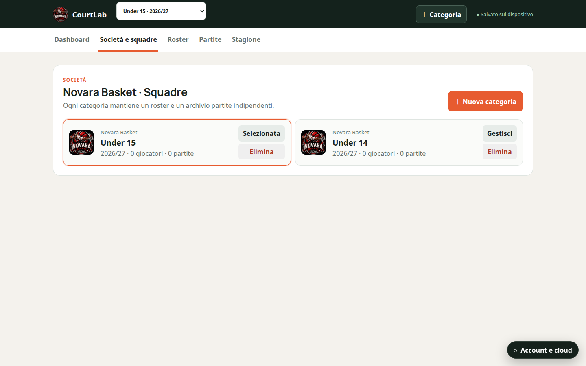
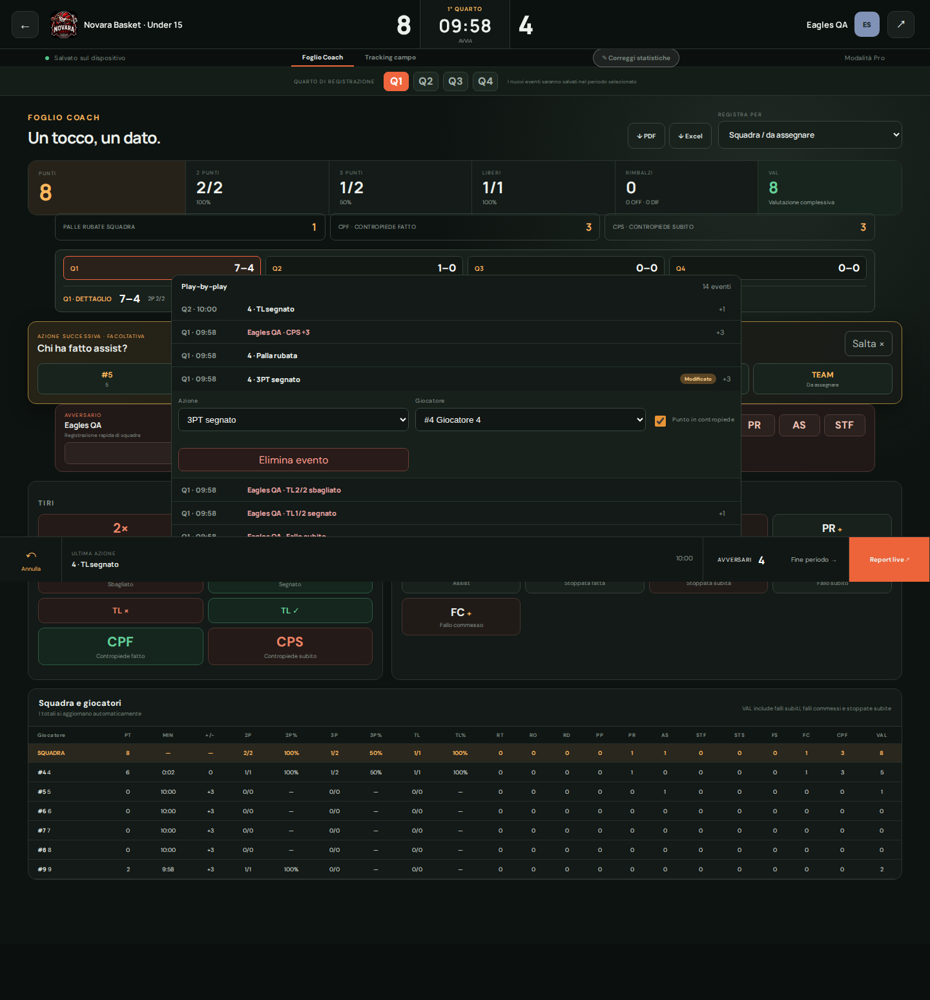
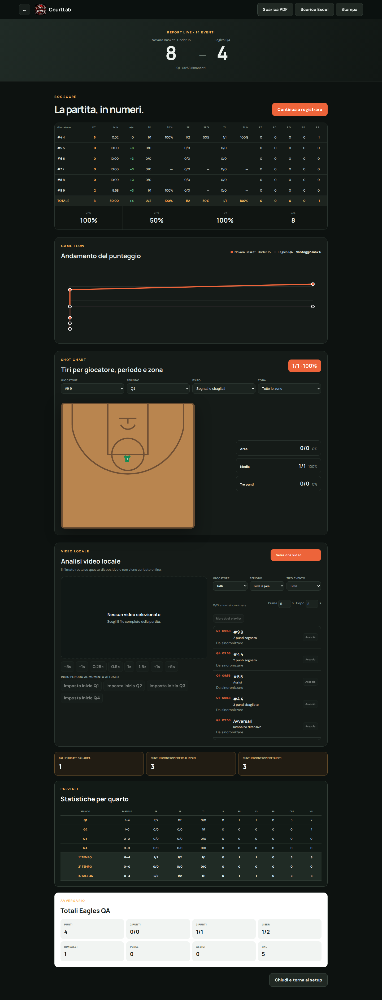

# CourtLab — Basketball Stats Coach

[Italiano](README.md) · [English](README.en.md)

CourtLab is a tablet-first, offline-capable PWA that helps coaches and staff
record, correct, and analyse statistics for five-on-five basketball games.

**Public demo:** [basketcoach.duckdns.org](https://basketcoach.duckdns.org)

> The demo contains test data. Before using CourtLab in an official game, run a
> complete simulated game on the device that will be used courtside.

## Preview

### Organisation and multiple teams



### Live tracking and event correction



### Box score, Game Flow, shot chart, and video analysis



## Who it is for

CourtLab was designed for youth and amateur basketball organisations that want
to replace pen and paper without slowing down the scorekeeper. One organisation
can manage several teams or age groups, such as Under 14, Under 15, and Under
17, each with its own roster, seasons, and games.

## How it works

A normal workflow has five steps:

1. **Organisation and teams** — create the organisation, add one or more teams
   or age groups, and select the season.
2. **Roster** — add players, jersey numbers, and the information required for
   the game roster.
3. **Game setup** — enter the opponent, date, and available players, then
   choose the starting five.
4. **Live tracking** — select a player and record shots, rebounds, turnovers,
   steals, assists, blocks, fouls, and fast-break points. Shots can be placed
   directly on the court.
5. **Review and export** — return to any period, correct events, and generate
   the box score or PDF and Excel reports.

Statistics are recalculated from recorded events rather than stored as
unrelated totals. Correcting an event therefore updates the affected player,
team, and period totals.

## Tracked statistics

| Code | Meaning |
|---|---|
| PTS | Points |
| 2PM / 2PA / 2P% | Two-point field goals made, attempted, and percentage |
| 3PM / 3PA / 3P% | Three-point field goals made, attempted, and percentage |
| FTM / FTA / FT% | Free throws made, attempted, and percentage |
| REB / DRB / ORB | Total, defensive, and offensive rebounds |
| TO / STL | Turnovers and steals |
| AST | Assists |
| BLK / BLA | Blocks made and shots blocked |
| FD / PF | Fouls drawn and committed |
| FBP / FBA | Fast-break points scored and allowed |
| VAL | Overall performance valuation |

The valuation is calculated as:

```text
VAL = PTS + REB + AST + STL + BLK + FD
      - missed field goals - missed free throws
      - TO - BLA - PF
```

The box score includes every column for both players and the team total. PDF and
Excel exports include the organisation logo; the Excel workbook uses
highlighted headers for easier reading and further analysis.

## Periods, splits, and corrections

Every event belongs to the quarter or overtime period in which it was recorded.
During a game, the operator can move forward or return to an earlier period
without losing events. The score strip displays every individual quarter score
at the same time.

Reports provide:

- first-half totals, combining Q1 and Q2;
- second-half totals, combining Q3 and Q4;
- full-game totals, combining every quarter and any overtime periods.

The play history can be corrected even after scouting has ended, and all
affected results are recalculated automatically.

## Court tracking and shot chart

When recording a shot, its court location is stored together with the player,
period, shot value, and outcome. The player's jersey number also makes them
recognisable on the chart.

The shot chart can be filtered by player, period, zone, and result, making it
easier to identify efficient areas and areas for improvement.

## Minutes, lineups, and game flow

Substitutions determine who is on the court and make it possible to reconstruct
minutes, lineups, and plus/minus. Game Flow connects the score to moments in the
game and the active lineup, showing runs and changes in momentum.

These results depend on accurate starting-lineup, substitution, and opponent
score tracking.

## Local video analysis

A video stored on the computer can be selected and linked to the corresponding
game moments. Coaches can create time references, notes, and sequences to
review shots, mistakes, and tactical situations quickly.

The video file **stays on the device** and is not uploaded to the server.
Because of browser security rules, the original file may need to be selected
again after closing or refreshing the page.

## Storage and synchronisation

CourtLab is offline-first: working data is stored locally in the browser through
IndexedDB, so an internet connection is not required during the game.

Cloud synchronisation is deliberately explicit:

1. on the device containing the latest changes, choose **Create new cloud
   version**;
2. on every other device, choose **Download cloud copy**;
3. if the cloud version changed in the meantime, CourtLab blocks the overwrite
   and reports a conflict;
4. previous revisions can be reviewed and restored.

You do not need to download the cloud copy after every change on the same
device. You do need to download it before continuing on another phone, tablet,
or computer. Until automatic merging is available, avoid editing the same game
on two devices at the same time.

Synchronisation is not a replacement for a proper backup policy. The production
server keeps periodic database backups, but important games should also be
checked through a final export.

## Local installation

Requirements:

- Node.js 20 or newer;
- npm;
- Python 3 for the synchronisation service.

Start the user interface:

```bash
npm install
npm run dev
```

Open the address displayed by Vite, usually `http://127.0.0.1:5173`.

Cloud service and production configuration details are available in the
[server documentation](server/README.md).

## Verification

```bash
npm test -- --run
npm run build
npm run qa
```

Browser checks require a local preview:

```bash
npm run preview -- --host 127.0.0.1
node scripts/qa-workspace.mjs
npm run qa:video
```

Screenshots and QA output are written to `artifacts/` and are not committed.

## Project structure and documentation

- [`src`](src) — React interface, statistics engine, and local storage;
- [`server`](server) — Python API, SQLite, revisions, and synchronisation;
- [`scripts`](scripts) — QA and maintenance tools;
- [Product specification](docs/product-spec.md) (Italian);
- [Data model and statistics engine](docs/data-and-stats.md) (Italian);
- [MVP backlog](docs/mvp-backlog.md) (Italian);
- [NotebookLM project dossier](docs/notebooklm-project-source.md) (Italian).

## Technology

The interface uses React, TypeScript, and Vite and is distributed as a PWA.
Local data is stored in IndexedDB, while synchronisation is handled by a Python
service backed by SQLite. In production, the application can run as a system
service behind an HTTPS reverse proxy.

## Privacy and security

- Never commit passwords, SSH keys, or other secrets to the repository.
- Videos selected for analysis are not uploaded to the cloud.
- Before publishing data about underage athletes, verify consent, access roles,
  and applicable regulations.
- The public repository contains source code and documentation, not the
  production database or real player profiles.

## Project status

CourtLab is under active development. It can already be used for simulations
and testing, but every release intended for an official game should first be
tested on the actual device, with particular attention to offline operation,
recovery, exports, and cross-device synchronisation.
